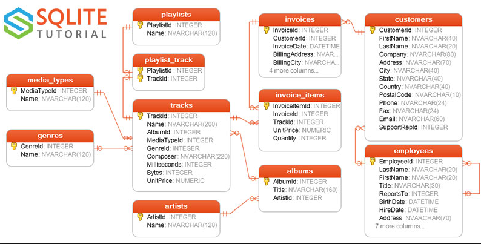

# Week 3
- [Practice Quiz](#practice-quiz)
- [Module 3 Coding Assignment](#module-3-coding-assignment)

*left to [Rubricator](../README.md)*

## Practice Quiz

All of the questions in this quiz pull from the open source Chinook Database. Please refer to the ER Diagram below and familiarize yourself with the table and column names to write accurate queries and get the appropriate answers.



**1. How many albums does the artist Led Zeppelin have?**
**How many records are returned?**

SQL code:</br> 
```SQL
SELECT COUNT(*) AS Count_albums
FROM (SELECT ar.name
		,al.title
      FROM artists ar LEFT JOIN albums al
      ON ar.artistid = al.artistid)
WHERE Name = 'Led Zeppelin';
```

Result:</br> 
| Count_albums |
|--- |
|           14 |

**2. Create a list of album titles and the unit prices for the artist "Audioslave".**

SQL code:</br> 
```SQL
SELECT albums.title
,tracks.unitprice
,artists.name
FROM tracks LEFT JOIN albums
ON tracks.albumid = albums.albumid
	LEFT JOIN artists
	ON artists.artistid = albums.artistid
WHERE artists.Name = 'Audioslave';
```

Result:</br> 
| Title        | UnitPrice | Name       |
|--- |--- |--- |
| Audioslave   |      0.99 | Audioslave |
| Audioslave   |      0.99 | Audioslave |
| Audioslave   |      0.99 | Audioslave |
| Audioslave   |      0.99 | Audioslave |
| Audioslave   |      0.99 | Audioslave |
| Audioslave   |      0.99 | Audioslave |
| Audioslave   |      0.99 | Audioslave |
| Audioslave   |      0.99 | Audioslave |
| Audioslave   |      0.99 | Audioslave |
| Audioslave   |      0.99 | Audioslave |
| Audioslave   |      0.99 | Audioslave |
| Audioslave   |      0.99 | Audioslave |
| Audioslave   |      0.99 | Audioslave |
| Audioslave   |      0.99 | Audioslave |
| Out Of Exile |      0.99 | Audioslave |
| Out Of Exile |      0.99 | Audioslave |
| Out Of Exile |      0.99 | Audioslave |
| Out Of Exile |      0.99 | Audioslave |
| Out Of Exile |      0.99 | Audioslave |
| Out Of Exile |      0.99 | Audioslave |
| Out Of Exile |      0.99 | Audioslave |
| Out Of Exile |      0.99 | Audioslave |
| Out Of Exile |      0.99 | Audioslave |
| Out Of Exile |      0.99 | Audioslave |
| Out Of Exile |      0.99 | Audioslave |

(Output limit exceeded, 25 of 40 total rows shown)

**3. Find the first and last name of any customer who does not have an invoice. Are there any customers returned from the query?**

SQL code:</br> 
```SQL
SELECT customers.FirstName
,customers.LastName
FROM customers LEFT JOIN invoices
ON customers.customerid = invoices.invoiceid
WHERE invoices.invoiceid = NULL;
```

Result:</br> 
| FirstName | LastName |
|--- |--- |
|--- |--- |

(Zero rows)

**4. Find the total price for each album.**
**What is the total price for the album “Big Ones”?**

SQL code:</br> 
```SQL
SELECT albums.Title
,tracks.UnitPrice
,Sum(UnitPrice) AS Count_title
FROM tracks LEFT JOIN albums
ON tracks.albumid = albums.albumid
WHERE Title  = 'Big Ones'
GROUP BY Title;
```

Result:</br> 
| Title    | UnitPrice | Count_title |
|--- |--- |--- |
| Big Ones |      0.99 |       14.85 |

**5. How many records are created when you apply a Cartesian join to the invoice and invoice items table?**
**Only 25 records will be shown in the output so please look at the bottom of the output to see how many records were retrieved.**

SQL code:</br> 
```SQL
SELECT invoices.invoiceid
FROM invoices CROSS JOIN invoice_items;
```

Result:</br> 
| InvoiceId |
|--- |
|         1 |
|         1 |
|         1 |
|         1 |
|         1 |
|         1 |
|         1 |
|         1 |
|         1 |
|         1 |
|         1 |
|         1 |
|         1 |
|         1 |
|         1 |
|         1 |
|         1 |
|         1 |
|         1 |
|         1 |
|         1 |
|         1 |
|         1 |
|         1 |
|         1 |

(Output limit exceeded, 25 of 922880 total rows shown)

*left to [Rubricator](../README.md)*

## Module 3 Coding Assignment

All of the questions in this quiz refer to the open source Chinook Database. Please familiarize yourself with the ER diagram in order to familiarize yourself with the table and column names in order to write accurate queries and get the appropriate answers.


**1. Using a subquery, find the names of all the tracks for the album "Californication".**</br>
**What is the title of the 8th track?**

SQL code:</br> 
```SQL
SELECT tracks.name
,albums.title 
FROM tracks LEFT JOIN albums
ON tracks.albumid = albums.albumid
WHERE albums.title = 'Californication'
LIMIT 8;
```

Result:</br> 
| Name              | Title           |
|--- |--- |
| Around The World  | Californication |
| Parallel Universe | Californication |
| Scar Tissue       | Californication |
| Otherside         | Californication |
| Get On Top        | Californication |
| Californication   | Californication |
| Easily            | Californication |
| Porcelain         | Californication |

**2. Find the total number of invoices for each customer along with the customer's full name, city and email.**</br>
**After running the query described above, what is the email address of the 5th person, František Wichterlová?**

SQL code:</br> 
```SQL
SELECT a.firstname
,a.lastname
,a.city
,a.email
,COUNT(a.invoiceid) AS Result
FROM( SELECT customers.firstname
		,customers.lastname
		,customers.city
		,customers.email
		,Invoices.InvoiceId
		FROM invoices LEFT JOIN customers
		ON invoices.customerid = customers.customerid) as a
WHERE a.firstname = 'František'
GROUP BY a.Firstname;
```

Result:</br> 
| a.firstname | a.lastname  | a.city | a.email                  | Result |
|--- |--- |--- |--- |--- |
| František   | Wichterlová | Prague | frantisekw@jetbrains.com |      7 |

**3. Retrieve the track name, album, artistID, and trackID for all the albums.**</br>
**What is the song title of trackID 12 from the "For Those About to Rock We Salute You" album?**

SQL code:</br> 
```SQL
SELECT tracks.name
,albums.title 
FROM tracks LEFT JOIN albums
ON tracks.albumid = albums.albumid
WHERE albums.title = 'Californication'
LIMIT 8;
```

Result:</br> 
| Name               | Title                                 | ArtistId | TrackId |
|--- |--- |--- |--- |
| Breaking The Rules | For Those About To Rock We Salute You |        1 |      12 |

**4. Retrieve a list with the managers last name, and the last name of the employees who report to him or her.**</br>
**After running the query described above, who are the reports for the manager named Mitchell?**

SQL code:</br> 
```SQL
Select b.LastName AS Manager_Name
,a.LastName AS Employee_Name
FROM employees AS a LEFT JOIN employees AS b
ON a.reportsto = b.employeeid
WHERE Manager_Name = 'Mitchell';
```

Result:</br> 
| Manager_Name | Employee_Name |
|--- |--- |
| Mitchell     | King          |
| Mitchell     | Callahan      |

**5. Find the name and ID of the artists who do not have albums.**</br>
**After running the query described above, two of the records returned have the same last name.**

SQL code:</br> 
```SQL
SELECT Name AS Artist
,Artists.ArtistId
,Albums.Title AS Album
FROM Artists LEFT JOIN Albums
ON Artists.ArtistId = Albums.ArtistId
WHERE Album IS NULL;
```

Result:</br> 
| Artist                     | ArtistId | Album |
|--- |--- |--- |
| Milton Nascimento & Bebeto |       25 |  None |
| Azymuth                    |       26 |  None |
| João Gilberto              |       28 |  None |
| Bebel Gilberto             |       29 |  None |
| Jorge Vercilo              |       30 |  None |
| Baby Consuelo              |       31 |  None |
| Ney Matogrosso             |       32 |  None |
| Luiz Melodia               |       33 |  None |
| Nando Reis                 |       34 |  None |
| Pedro Luís & A Parede      |       35 |  None |

(Output limit exceeded, 10 of 71 total rows shown)

**6. Use a UNION to create a list of all the employee's and customer's first names and last names ordered by the last name in descending order.**</br>
**After running the query described above, determine what is the last name of the 6th record?**

SQL code:</br> 
```SQL
SELECT firstname
,lastname
FROM employees 
UNION
SELECT firstname
,lastname
FROM customers
ORDER BY lastname DESC
LIMIT 6;
```

Result:</br> 
| firstname | lastname     |
|--- |--- |
| Fynn      | Zimmermann   |
| Stanisław | Wójcik       |
| František | Wichterlová  |
| Johannes  | Van der Berg |
| François  | Tremblay     |
| Mark      | Taylor       |

**7. See if there are any customers who have a different city listed in their billing city versus their customer city.**</br>
**What is the title of the 8th track?**

SQL code:</br> 
```SQL
SELECT customers.FirstName
,customers.City
,invoices.BillingCity
FROM customers LEFT JOIN invoices 
ON customers.customerid = invoices.customerid
WHERE customers.City <> invoices.BillingCity;
```

Result:</br> 
| FirstName | City | BillingCity |
|--- |--- |--- |
|--- |--- |--- |

(Zero rows)

*left to [Rubricator](../README.md)*